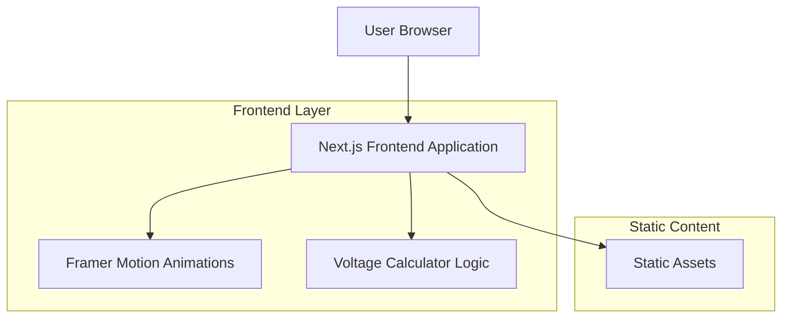

## 1. Architecture Design



## 2. Technology Description

- **Frontend**: Next.js@14 + React@18 + TypeScript
- **Styling**: TailwindCSS@3 + Custom CSS animations
- **Animation Library**: Framer Motion@10
- **Icons**: Lucide React + Custom solar icons
- **Initialization Tool**: create-next-app
- **Deployment**: Static export (no backend required)

## 3. Route Definitions

| Route | Purpose |
|-------|---------|
| / | Landing page with hero animation and voltage calculator |
| /about | Company information and team section |
| /services | Detailed service offerings and process |
| /contact | Contact form and location information |

## 4. Component Architecture

### 4.1 Core Components

```typescript
// Hero Section Component
interface HeroSectionProps {
  title: string;
  subtitle: string;
  animationVariants: Variants;
}

// Voltage Calculator Component
interface CalculatorForm {
  monthlyConsumption: number;
  roofArea: number;
  location: string;
  peakSunHours: number;
}

interface CalculatorResult {
  recommendedVoltage: number;
  panelCount: number;
  estimatedSavings: number;
}
```

### 4.2 Animation Configurations

```typescript
// Framer Motion Variants
const heroVariants = {
  initial: { opacity: 0, y: 50 },
  animate: { 
    opacity: 1, 
    y: 0,
    transition: {
      duration: 0.8,
      ease: "easeOut"
    }
  }
};

const solarPanelVariants = {
  initial: { scale: 0.8, rotate: -5 },
  animate: { 
    scale: 1, 
    rotate: 0,
    transition: {
      duration: 1.2,
      ease: "easeInOut"
    }
  }
};
```

## 5. Voltage Calculator Implementation

### 5.1 Calculation Logic

```typescript
export function calculateSolarOutput(form: CalculatorForm): CalculatorResult {
  const systemEfficiency = 0.85; // 85% efficiency
  const panelWattage = 400; // 400W panels
  
  const dailyConsumption = form.monthlyConsumption / 30;
  const requiredDailyProduction = dailyConsumption / systemEfficiency;
  const requiredWattage = requiredDailyProduction / form.peakSunHours;
  
  const panelCount = Math.ceil(requiredWattage / panelWattage);
  const recommendedVoltage = panelCount <= 10 ? 12 : panelCount <= 20 ? 24 : 48;
  
  return {
    recommendedVoltage,
    panelCount,
    estimatedSavings: dailyConsumption * 0.15 * 365 // 15% savings estimate
  };
}
```

### 5.2 Form Validation

```typescript
const calculatorSchema = z.object({
  monthlyConsumption: z.number().min(100).max(5000),
  roofArea: z.number().min(10).max(500),
  location: z.string().min(2).max(50),
  peakSunHours: z.number().min(3).max(8)
});
```

## 6. Static Asset Structure

```
public/
├── images/
│   ├── hero/
│   │   ├── solar-panels-1.jpg
│   │   └── solar-panels-2.jpg
│   ├── services/
│   │   ├── residential-solar.jpg
│   │   ├── commercial-solar.jpg
│   │   └── industrial-solar.jpg
│   └── team/
│       ├── member-1.jpg
│       └── member-2.jpg
├── icons/
│   ├── solar-panel.svg
│   ├── energy.svg
│   └── renewable.svg
└── animations/
    ├── hero-animation.json
    └── calculator-animation.json
```

## 7. Performance Optimizations

### 7.1 Image Optimization
- Use Next.js Image component for automatic optimization
- Implement lazy loading for below-fold images
- Use WebP format with fallbacks

### 7.2 Animation Performance
- Use CSS transforms instead of position properties
- Implement will-change for animated elements
- Use React.memo for expensive components

### 7.3 Bundle Size
- Tree-shake unused Framer Motion features
- Code-split by route
- Optimize TailwindCSS purge settings

## 8. Deployment Configuration

### 8.1 Static Export
```json
{
  "scripts": {
    "build": "next build",
    "export": "next export",
    "deploy": "next build && next export"
  }
}
```

### 8.2 Environment Variables
```env
NEXT_PUBLIC_COMPANY_NAME=Agalid
NEXT_PUBLIC_CONTACT_EMAIL=contact@agalid.com
NEXT_PUBLIC_PHONE_NUMBER=+1234567890
```

## 9. Browser Support

- Chrome 90+
- Firefox 88+
- Safari 14+
- Edge 90+
- Mobile browsers with ES6+ support