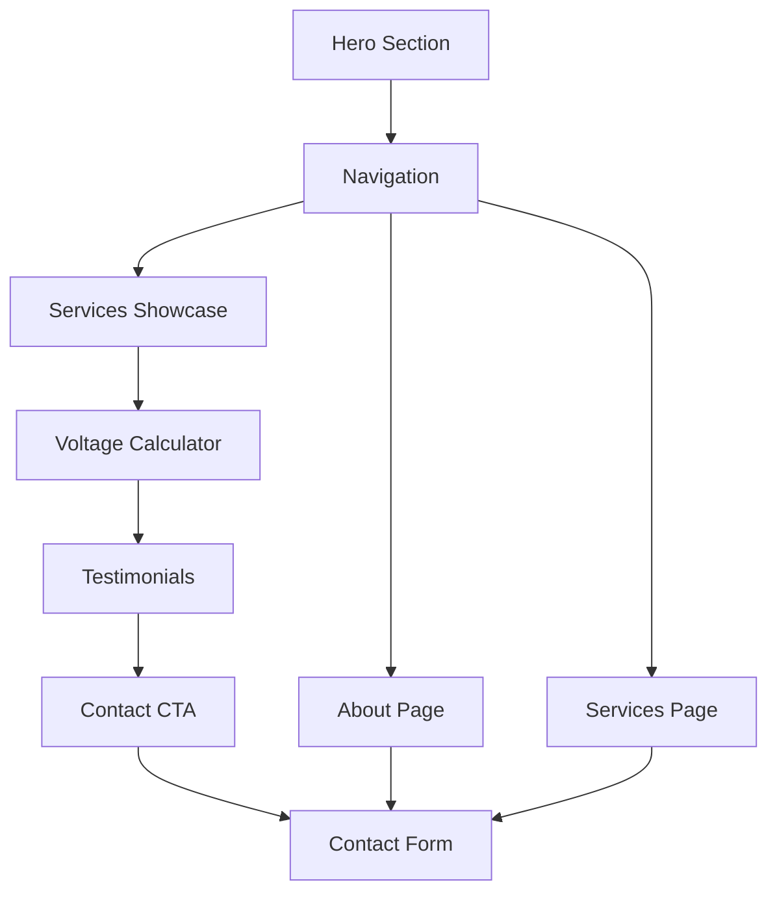

## 1. Product Overview
Agalid is a solar energy company website showcasing renewable energy solutions. The website features a modern, animated interface with a special hero section and an interactive voltage calculator for potential clients to estimate their solar energy needs.

Target audience: Homeowners and businesses interested in solar panel installation and renewable energy solutions.

## 2. Core Features

### 2.1 User Roles
No user authentication required - this is a public-facing informational website.

### 2.2 Feature Module
The website consists of the following main pages:
1. **Landing Page**: Hero section with special animation, company introduction, services showcase, voltage calculator section, testimonials, and contact information.
2. **About Page**: Company mission, team, and renewable energy expertise.
3. **Services Page**: Detailed solar panel solutions and renewable energy services.
4. **Contact Page**: Contact form and company location details.

### 2.3 Page Details
| Page Name | Module Name | Feature description |
|-----------|-------------|---------------------|
| Landing Page | Hero Section | Animated hero section with special Framer animations showcasing solar energy benefits and company branding. |
| Landing Page | Navigation | Sticky navigation bar with smooth scroll to sections and mobile-responsive hamburger menu. |
| Landing Page | Services Showcase | Grid or carousel displaying solar panel types, installation services, and renewable energy solutions with hover effects. |
| Landing Page | Voltage Calculator | Interactive form where clients input their energy consumption details and receive calculated voltage output recommendations for solar panel selection. |
| Landing Page | Testimonials | Customer reviews and success stories with animated transitions. |
| Landing Page | Contact CTA | Call-to-action section with contact information and consultation booking. |
| About Page | Company Story | Company history, mission, and commitment to renewable energy with timeline animations. |
| About Page | Team Section | Team member profiles with hover effects and professional photos. |
| Services Page | Service Categories | Detailed descriptions of residential, commercial, and industrial solar solutions. |
| Services Page | Process Timeline | Step-by-step installation process with animated progress indicators. |
| Contact Page | Contact Form | Form with fields for name, email, phone, project type, and message with validation. |
| Contact Page | Location Map | Interactive map showing company location and service areas. |

## 3. Core Process
User visits the website → Views animated hero section → Scrolls through services → Uses voltage calculator to estimate needs → Reads testimonials → Navigates to specific service pages → Contacts company through form or direct contact information.

## 4. User Interface Design

### 4.1 Design Style
- **Primary Colors**: Solar yellow (#FFD700), Clean white (#FFFFFF), Professional blue (#1E40AF)
- **Secondary Colors**: Energy green (#10B981), Dark gray (#374151) for text
- **Button Style**: Rounded corners with gradient effects, hover animations
- **Typography**: Modern sans-serif (Inter or Poppins), heading sizes 48px-32px, body 16px
- **Layout**: Card-based design with generous spacing and grid layouts
- **Icons**: Solar-themed icons and energy symbols with smooth animations

### 4.2 Page Design Overview
| Page Name | Module Name | UI Elements |
|-----------|-------------|-------------|
| Landing Page | Hero Section | Full-screen with animated solar panels, particle effects, gradient backgrounds, and floating elements using Framer Motion. |
| Landing Page | Voltage Calculator | Card-based form with input fields for monthly consumption, roof area, and location, with animated result display showing recommended voltage and panel count. |
| Landing Page | Services | 3D card hover effects, icon animations, and smooth transitions between service categories. |
| All Pages | Navigation | Glass-morphism effect, smooth scroll animations, and mobile-first responsive design. |

### 4.3 Responsiveness
Desktop-first design approach with mobile optimization. Touch-friendly interactions for mobile devices, responsive grid layouts, and optimized animations for different screen sizes.